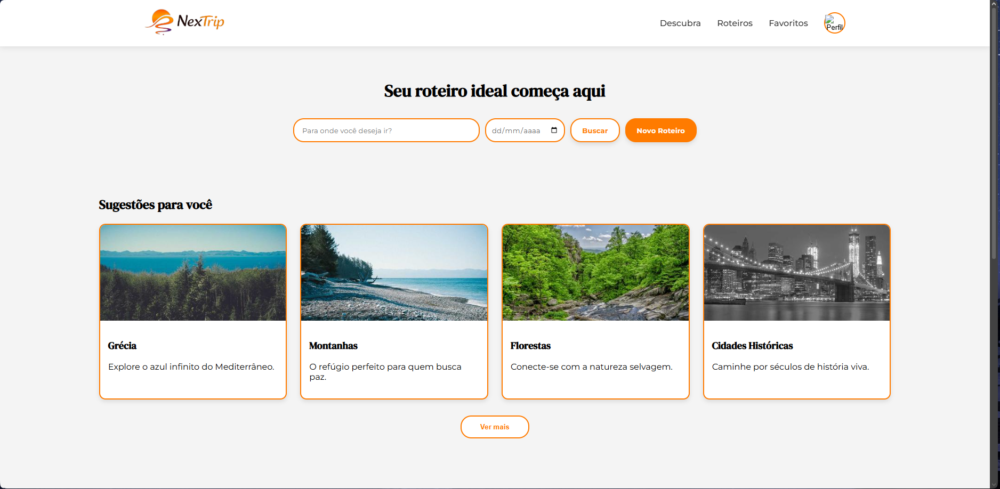
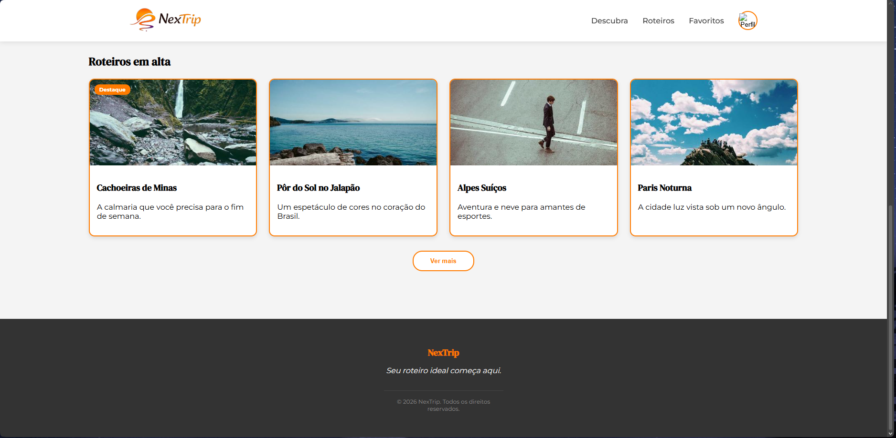
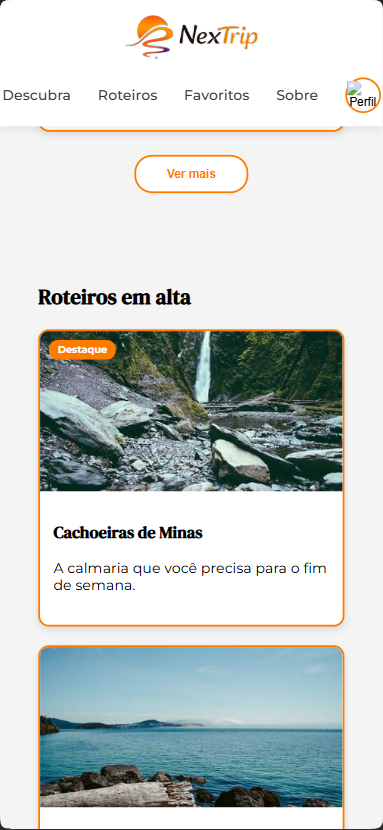

# Trabalho Prático - Semana 5
## Informações Gerais
- Nome: João Pedro Oliveira Monteiro Moura
- Matricula: 923902
- Proposta de projeto escolhida: Site de Roteiros de Viagem Personalizados
- Breve descrição sobre seu projeto:
O NexTrip é uma plataforma digital desenhada para simplificar a descoberta de novos destinos. Com um visual moderno e limpo, o projeto foca em oferecer sugestões personalizadas de viagens e roteiros que estão em alta. Através de uma interface intuitiva, o usuário pode explorar lugares incríveis, buscar destinos específicos e planejar sua próxima experiência inesquecível com apenas alguns cliques.

## Print da versão responsiva com CSS puro [DESKTOP]

## Print da versão responsiva com CSS puro [MOBILE] (*)

(*) Utilize as ferramentas do desenvolvedor do seu navegador para colocar no modo reponsivo, escolha um celular qualquer e recarregue a página antes de tirar o print.